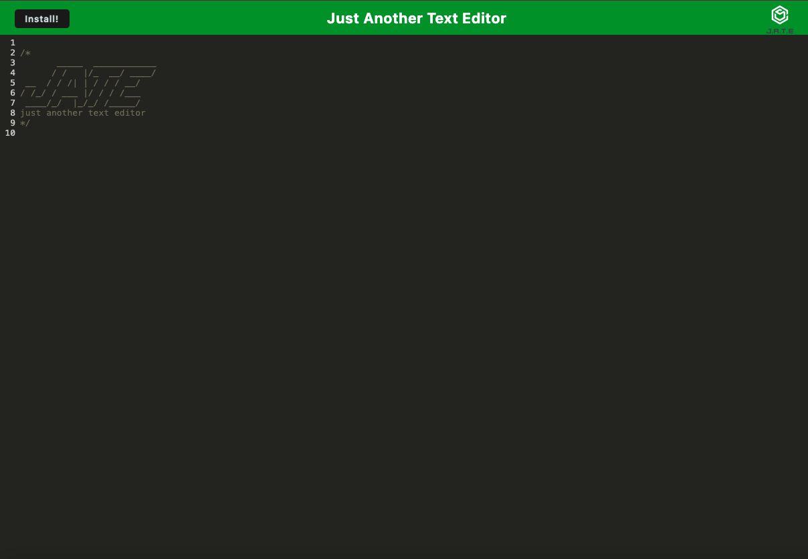

# Hiduchick-Text-Editor

## Table of Contents
- [Description](#description)
- [Technologies Used](#technologies-used)
- [Usage](#usage)
- [Author/Credits](#author-credits)

## Descripion
This text editor is a versatile tool for creating and storing notes or code snippets, accessible for later use. It's a single-page application that meets Progressive Web App (PWA) standards, ensuring a seamless experience across devices and browsers.

With robust data-persistence techniques like local storage and IndexedDB, user data remains secure even if certain browser features are unavailable. Plus, its offline capabilities ensure uninterrupted access, making it ideal for use anytime, anywhere.

Deployed on Render for simplicity and scalability, this editor offers reliable performance. 
-- [ApplicationLink](https://hiduchick-text-editor.onrender.com) --

Here's a glimpse of the application:

## Technologies Used
- HTML
- CSS
- Javascript
- Express.js
- Node.js
- Webpack for bundling
- Service Worker for offline use
- IndexedDB for database storage

## Usage
- Upon initiating the text editor, IndexedDB promptly establishes a database storage.
- Content entered into the text editor is automatically stored in IndexedDB upon clicking outside the DOM window.
- Upon reopening the text editor post-closure, content is fetched from IndexedDB for restoration.
- By clicking the install button, the web application can be downloaded and installed as a desktop icon.
- Even in offline mode, the page loads smoothly due to pre-caching of static assets during initial loading, including subsequent pages and static assets.

## Author-Credits
Starter code provided by edX Boot Camps LLC.

All edits ˖⁺‧₊˚♡˚₊‧⁺˖ by Daelyn Hiduchick